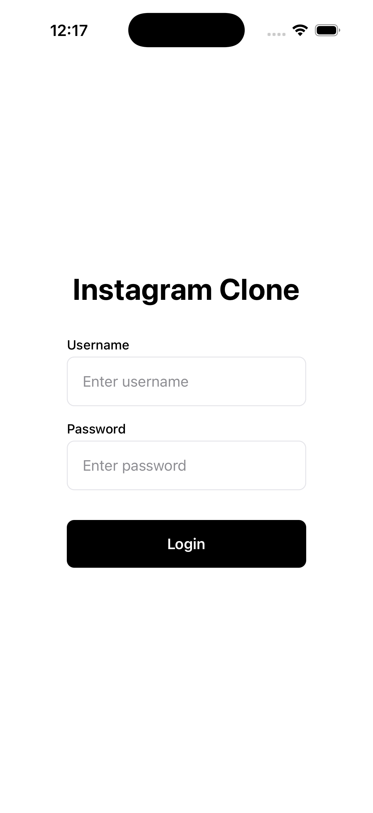
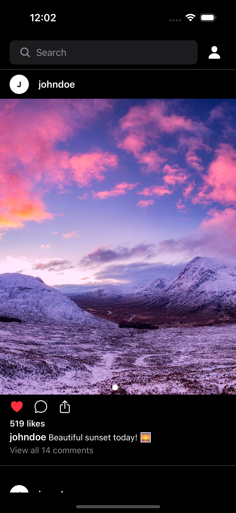
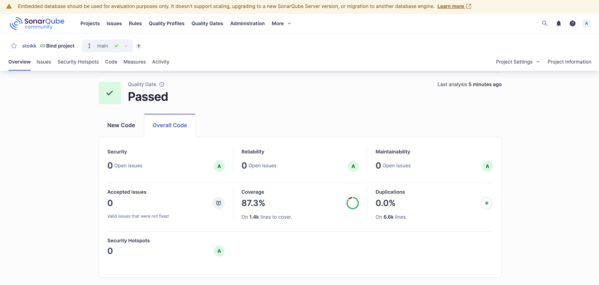

# 📱 React Native Social Media Boilerplate

<p align="center">
  
  
  
  
</p>

<p align="center">
  <b>Production-ready React Native boilerplate for building social media applications.</b>
  <br />
  Instagram-inspired architecture with best practices built-in.
</p>

---

## 📸 Screenshots

<p align="center">
  
  
  
  
</p>

---

## ✨ Features

| Feature | Description |
|---------|-------------|
| 🔐 **Secure Authentication** | Keychain/Keystore integration with token management |
| 📜 **Infinite Feed** | Optimized FlatList with pagination & pull-to-refresh |
| 🖼️ **Progressive Image Loading** | Thumbnail → High-res with 10MB+ image support |
| 🎥 **Video Autoplay** | Viewport-based play/pause with buffer optimization |
| 🔍 **Search** | Real-time filtering with responsive grid layout |
| 🌙 **Theming** | Light/Dark mode support with Theme Context |
| 📱 **Responsive Design** | Adaptive layouts for phones, tablets, and desktops |
| 🧪 **Well Tested** | 80%+ coverage with Jest & React Native Testing Library |
| 🏗️ **Atomic Design** | Scalable component architecture (Atoms → Molecules → Organisms) |
| ⚡ **Performance** | FastImage caching, Reanimated animations, optimized renders |

---

## 🚀 Quick Start

### Prerequisites

- Node.js >= 20
- React Native CLI
- iOS: Xcode, CocoaPods
- Android: Android Studio, JDK

### Installation

```bash
# Clone the repository
git clone https://github.com/YOUR_USERNAME/rn-social-boilerplate.git
cd rn-social-boilerplate

# Install dependencies
npm install

# iOS: Install CocoaPods
cd ios && pod install && cd ..

# Start Metro bundler
npm start

# Run on iOS
npm run ios

# Run on Android
npm run android
```

---

## 🏗️ Architecture

### Folder Structure

```
src/
├── components/
│   ├── Atoms/           # Basic building blocks (Icon, ThemedText, ThemedView)
│   ├── Molecules/       # Composite components (Button, Input, Avatar, SearchBar)
│   └── Organisms/       # Complex components (Post, MediaGrid, ErrorBoundary)
├── screens/
│   ├── Feed/            # Main feed with infinite scroll
│   ├── Login/           # Secure authentication
│   ├── Search/          # Grid search with video autoplay
│   └── Profile/         # User profile display
├── navigation/          # React Navigation setup
├── store/
│   ├── api/             # RTK Query API slices
│   └── slices/          # Redux slices
├── services/            # API & utility services
├── hooks/               # Custom React hooks
├── contexts/            # React contexts (Theme)
├── types/               # TypeScript definitions
├── constants/           # App constants
└── utils/               # Helper functions
```

### State Management

**Redux Toolkit + RTK Query** for:
- Built-in caching and invalidation
- Automatic loading/error states
- TypeScript-first API
- Minimal boilerplate

### Navigation

**React Navigation v6** with:
- Native Stack Navigator
- Type-safe navigation
- Auth-based routing

---

## 🛠️ Tech Stack

| Category | Technology |
|----------|------------|
| **Framework** | React Native 0.82 |
| **Language** | TypeScript (Strict Mode) |
| **State Management** | Redux Toolkit + RTK Query |
| **Navigation** | React Navigation v6 |
| **Styling** | StyleSheet + Theme Context |
| **Image Handling** | react-native-fast-image |
| **Video Player** | react-native-video |
| **Animations** | react-native-reanimated |
| **Secure Storage** | react-native-keychain |
| **Testing** | Jest + React Native Testing Library |

---

## 📦 What's Included

### Screens

| Screen | Features |
|--------|----------|
| **Login** | Secure credential storage, form validation |
| **Feed** | Infinite scroll, like functionality, image carousel |
| **Search** | Grid layout, video autoplay, real-time filtering |
| **Profile** | User info display, logout functionality |

### Components (Atomic Design)

**Atoms (3)**
- `Icon` - Vector icon wrapper
- `ThemedText` - Theme-aware text
- `ThemedView` - Theme-aware container

**Molecules (10)**
- `Avatar` - User avatar with fallback
- `BackButton` - Navigation back button
- `Button` - Customizable button
- `CustomVideo` - Video player with controls
- `EmptyState` - Empty list placeholder
- `ImageWithThumbnail` - Progressive image loading
- `Input` - Text input with validation
- `OfflineNotification` - Network status banner
- `SearchBar` - Search input
- `Skeleton` - Shimmer loading placeholder

**Organisms (9)**
- `ErrorBoundary` - Error catching wrapper
- `ErrorFallback` - Error display UI
- `LoadingScreen` - Full-screen loader
- `MediaGrid` - Responsive media grid
- `MediaGridItem` - Grid item component
- `Post` - Social media post
- `PostImageCarousel` - Swipeable image carousel
- `PostVideo` - Video post component
- `SearchHeader` - Search screen header

### Custom Hooks

| Hook | Purpose |
|------|---------|
| `useAuthRTK` | Authentication management with RTK |
| `useGetPosts` | Post fetching with pagination |
| `useImagePrefetch` | Image preloading optimization |
| `useMediaPlayerVisibility` | Viewport-based video control |
| `useBreakpoint` | Responsive design breakpoints |
| `useNetwork` | Network connectivity status |
| `usePostListManager` | Post list state management |
| `useTheme` | Theme context access |
| `useLockOrientation` | Screen orientation control |

### Services

| Service | Purpose |
|---------|---------|
| `authService` | Authentication logic |
| `postService` | Post data management |
| `secureStorageService` | Keychain/Keystore wrapper |
| `imageCacheService` | Image cache management |
| `networkService` | Network request handling |
| `errorService` | Error handling utilities |

---

## 🎯 Use Cases

This boilerplate is perfect for building:

- 📸 **Photo Sharing Apps** (Instagram-like)
- 🎬 **Video Platforms** (TikTok-like)
- 💬 **Social Networks**
- 📰 **News/Content Feeds**
- 🛒 **E-commerce with Social Features**
- 🎨 **Portfolio/Showcase Apps**

---

## 🔧 Customization

### Replace Mock API

The boilerplate uses mock data by default. To connect to a real API:

```typescript
// src/store/api/postApi.ts
// Replace mock endpoints with your actual API calls

export const postApi = createApi({
  baseQuery: fetchBaseQuery({ baseUrl: 'https://your-api.com' }),
  endpoints: (builder) => ({
    getPosts: builder.query({
      query: ({ page, limit }) => `/posts?page=${page}&limit=${limit}`,
    }),
  }),
});
```

### Add New Screens

1. Create screen folder in `src/screens/YourScreen/`
2. Add to navigation in `src/navigation/AppNavigator.tsx`
3. Update types in `src/navigation/types.ts`

### Theming

Customize colors, spacing, and typography in:

```typescript
// src/styles/theme.ts
export const lightTheme = {
  colors: {
    primary: '#YOUR_COLOR',
    background: '#YOUR_COLOR',
    // ...
  },
};
```

### Environment Configuration

```typescript
// src/constants/api.constants.ts
export const API_CONFIG = {
  BASE_URL: 'https://your-api.com',
  MOCK_DELAY: 500, // Remove for production
};
```

---

## 📊 Quality & Testing

### Test Coverage (≥80%)

```bash
# Run tests
npm test

# Run with coverage report
npm test -- --coverage
```

### Code Quality

```bash
# Lint check
npm run lint

# TypeScript check
npx tsc --noEmit
```

### SonarQube Integration

Pre-configured `sonar-project.properties` for code quality analysis.

<p align="center">
  
</p>

---

## 📖 Documentation

### Media Handling Strategy

**Feed Screen: Progressive Loading**
1. Show thumbnail immediately (fast, low bandwidth)
2. Load high-resolution image in background
3. Crossfade from thumbnail to high-res

**Search Screen: Thumbnail Only**
- Grid shows only thumbnails for performance
- 12-20+ items visible simultaneously
- Prevents memory overflow with large images

**Video Handling**
- Viewport-based autoplay/pause
- Buffer optimization (15-50s buffer)
- Error fallback to thumbnail

### Performance Optimizations

- **FlatList**: Stable keys, memoization, virtualization
- **Images**: FastImage with disk + memory cache
- **Videos**: Hardware acceleration, aggressive memory mode
- **Animations**: Reanimated for 60 FPS UI thread animations

---

## 🤝 Contributing

Contributions are welcome! Please read our [Contributing Guidelines](CONTRIBUTING.md) first.

1. Fork the repository
2. Create your feature branch (`git checkout -b feature/amazing-feature`)
3. Commit your changes (`git commit -m 'Add amazing feature'`)
4. Push to the branch (`git push origin feature/amazing-feature`)
5. Open a Pull Request

---

## 📄 License

This project is licensed under the MIT License - see the [LICENSE](LICENSE) file for details.

---

## ⭐ Support

If this project helped you, please give it a ⭐ on GitHub!

---

<p align="center">
  Made with ❤️ for the React Native community
</p>
